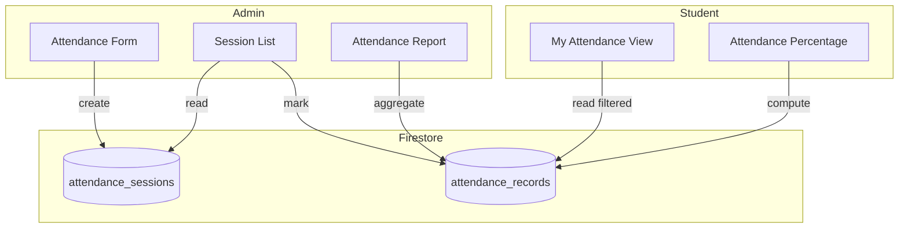
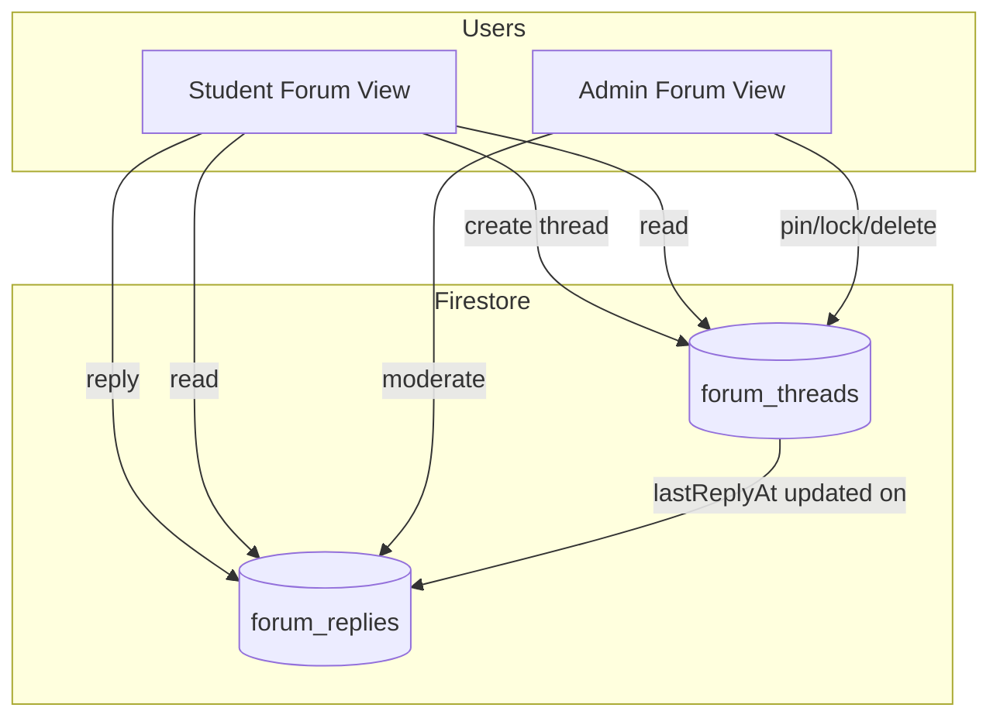
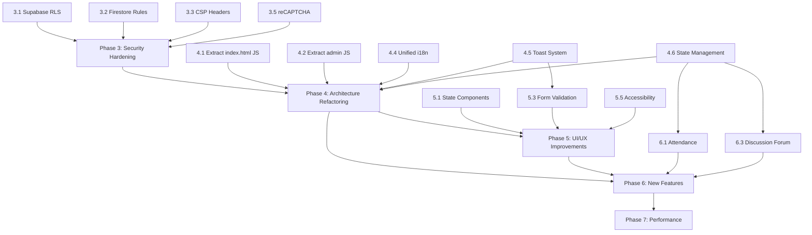

# DIS Student Study Portal — Phase 3+ Comprehensive Roadmap

> **Status:** Draft — Ready for Review
> **Date:** 2026-06-01
> **Context:** Follows completion of Phase 2 (security fixes in sanitize.js, resourceManager.js, noticeManager.js)

---

## Executive Summary

This roadmap covers the complete transformation of the DIS Student Study Portal across five coordinated phases:

| Phase | Focus | Priority |
|-------|-------|----------|
| **Phase 3** | Security Hardening | 🔴 Immediate |
| **Phase 4** | Architecture Refactoring | 🔴 Foundation |
| **Phase 5** | UI/UX Improvements | 🟡 Enhancement |
| **Phase 6** | New Features | 🟢 Growth |
| **Phase 7** | Performance & Optimization | 🟢 Polish |

**Key Principle:** Phases 3–4 MUST be completed before Phase 6 (new features). Building features on the current monolithic inline-JS architecture would compound technical debt exponentially.

---

## Phase 3: Security Hardening

### 3.1 Supabase RLS Policy Fix

**Current State:** All 4 RLS policies use `TO public USING (true)` — anyone can read/write/delete any file.

**Action:** Update [`supabase-storage-fix.sql`](supabase-storage-fix.sql:1) to restrict to authenticated users:

```sql
-- Replace TO public with TO authenticated
CREATE POLICY "Allow authenticated uploads" ON storage.objects
FOR INSERT TO authenticated
WITH CHECK (bucket_id = 'resources');

CREATE POLICY "Allow authenticated reads" ON storage.objects
FOR SELECT TO authenticated
USING (bucket_id = 'resources');

CREATE POLICY "Allow owner updates" ON storage.objects
FOR UPDATE TO authenticated
USING (bucket_id = 'resources' AND owner = auth.uid());

CREATE POLICY "Allow owner deletes" ON storage.objects
FOR DELETE TO authenticated
USING (bucket_id = 'resources' AND owner = auth.uid());
```

**Files affected:** [`supabase-storage-fix.sql`](supabase-storage-fix.sql:1) — requires running in Supabase SQL Editor

### 3.2 Firestore Security Rules Audit

**Current State:** Unknown — rules cannot be audited from client-side code alone.

**Action:** Verify from Firebase Console:
- `users` collection: Only authenticated users can read their own doc; admin can read all
- `resources` collection: Authenticated users can read; only owners/admins can write/delete
- `notices` collection: Authenticated users can read; only admins can write
- `routines` collection: Authenticated users can read; only admins can write
- `course_mappings` collection: Authenticated users can read; only admins can write

**Files affected:** Firebase Console only (no code changes)

### 3.3 Content Security Policy (CSP) Header

**Current State:** No CSP meta tag anywhere.

**Action:** Add to all 4 HTML pages inside `<head>`:

```html
<meta http-equiv="Content-Security-Policy"
      content="default-src 'self';
               script-src 'self' 'unsafe-inline' https://www.gstatic.com https://cdn.jsdelivr.net;
               style-src 'self' 'unsafe-inline' https://cdn.jsdelivr.net https://cdnjs.cloudflare.com;
               img-src 'self' data: https:;
               connect-src 'self' https://*.firebaseio.com https://*.supabase.co https://identitytoolkit.googleapis.com;
               font-src 'self' https://cdnjs.cloudflare.com;
               frame-src 'self';">
```

**Files affected:** [`index.html`](index.html:4), [`admin-dashboard.html`](admin-dashboard.html:4), [`login.html`](login.html:4), [`dept-gate-2026.html`](dept-gate-2026.html:4)

### 3.4 Password Change via Firebase Auth (Already Fixed)

**Current State:** Already uses `updatePassword(auth.currentUser, newPass)` in [`index.html`](index.html:1223) — ✅ No action needed.

### 3.5 reCAPTCHA on Auth Forms

**Current State:** No bot protection on login/register forms.

**Action:** Add Firebase App Check or Google reCAPTCHA v3 to login and registration forms.

**Files affected:** [`login.html`](login.html:45) (login + register forms)

---

## Phase 4: Architecture Refactoring

This is the **highest-value investment** in the entire roadmap. The current ~2,150 lines of inline JS across HTML files must be extracted into proper modules.

### 4.1 Extract index.html Inline JS (~850 lines)

**Current state:** Lines 683–1261 in [`index.html`](index.html:683) contain all student portal logic inline.

**Target modules:**

| New Module | Purpose | From HTML Lines |
|------------|---------|-----------------|
| `assets/js/portal/state.js` | Application state management (single source of truth) | 823–837 |
| `assets/js/portal/filters.js` | Academic filter logic + URL hash sync | 839–843, 904–906, 919–930, 938–943 |
| `assets/js/portal/init.js` | Bootstrap: auth listener, module wiring, event binding | 1099–1261 |
| `assets/js/portal/profile.js` | Profile modal + form handling | 1150–1257 |

**Files already extracted (Phase 2):**
- [`assets/js/portal/routines.js`](assets/js/portal/routines.js:1) — routine + notice listeners ✅
- [`assets/js/portal/courses.js`](assets/js/portal/courses.js:1) — course grid, detail, resource rendering ✅
- [`assets/js/portal/upload.js`](assets/js/portal/upload.js:1) — resource upload/edit/delete ✅

**After refactoring:** [`index.html`](index.html:683) will contain only a ~50-line bootstrap script that imports and wires modules.

### 4.2 Extract admin-dashboard.html Inline JS (~650 lines)

**Current state:** Lines 246–522 in [`admin-dashboard.html`](admin-dashboard.html:246).

**Target modules:**

| New Module | Purpose | From HTML Lines |
|------------|---------|-----------------|
| `assets/js/admin/init.js` | Admin bootstrap: auth check, event wiring, modal routing | 277–302, 460–522 |
| `assets/js/admin/state.js` | Admin shared state (activeEditId, tabs, caches) | 277–288 |

**Files already extracted (Phase 2):**
- [`assets/js/admin/routineManager.js`](assets/js/admin/routineManager.js:1) ✅
- [`assets/js/admin/courseMapper.js`](assets/js/admin/courseMapper.js:1) ✅
- [`assets/js/admin/noticeManager.js`](assets/js/admin/noticeManager.js:1) ✅
- [`assets/js/admin/studentManager.js`](assets/js/admin/studentManager.js:1) ✅
- [`assets/js/admin/resourceManager.js`](assets/js/admin/resourceManager.js:1) ✅

**After refactoring:** [`admin-dashboard.html`](admin-dashboard.html:246) will contain only a ~40-line bootstrap script.

### 4.3 Populate Empty admin.js Module

**Current state:** [`assets/js/admin.js`](assets/js/admin.js:1) is 1 line — empty.

**Action:** Move the admin bootstrap logic here, or repurpose as a barrel export module:

```js
// assets/js/admin.js — Admin barrel exports
export { handleRoutineFormSubmit } from "./admin/routineManager.js";
export { handleCourseMapSubmit } from "./admin/courseMapper.js";
export { handleNoticeFormSubmit } from "./admin/noticeManager.js";
export { renderStudentTable } from "./admin/studentManager.js";
export { renderAdminResourceList } from "./admin/resourceManager.js";
```

### 4.4 Unified i18n Integration

**Current state:** [`assets/js/i18n.js`](assets/js/i18n.js:1) exists but each page has its own `applyLanguage()` function and manual DOM updates.

**Action:** Create a centralized `applyLanguage()` function in i18n.js that:
- Accepts a namespace and a map of `{ elementId: translationKey }`
- Applies all translations in one call
- Supports RTL/LTR direction switching

**Files affected:**
- [`assets/js/i18n.js`](assets/js/i18n.js:1) — add `applyPageLanguage(ns, elementMap)` function
- [`login.html`](login.html:180) — replace ~20-line applyLanguage with 1 call
- [`index.html`](index.html:471) — consolidate scattered translation calls
- [`admin-dashboard.html`](admin-dashboard.html:244) — consolidate translation calls
- [`dept-gate-2026.html`](dept-gate-2026.html:46) — replace inline translation logic

### 4.5 Global Error Handling & Toast System

**Current state:** Errors use `alert()` (poor UX) or `console.error()` (invisible to users).

**Action:** Create `assets/js/toast.js`:

```js
// Toast notification system
// - showToast(message, type) — type: 'success' | 'error' | 'warning' | 'info'
// - Auto-dismiss after 5s
// - Stack multiple toasts
// - Accessible (aria-live region)
```

**Files affected:**
- New: [`assets/js/toast.js`](assets/js/toast.js) — toast notification module
- New: [`assets/css/toast.css`](assets/css/toast.css) — toast styles
- All 4 HTML pages — replace `alert()` calls with `showToast()`

### 4.6 State Management Module

**Current state:** State scattered across DOM attributes, global vars, localStorage.

**Action:** Create `assets/js/portal/state.js`:

```js
// Centralized application state
export const state = {
    user: { uid: null, name: "", isProfileIncomplete: false },
    academic: { trimesterKey: "", filters: { year, termNum, season, program, sessionYear } },
    courses: { mapped: [], snapshot: null, activeDetailIndex: null },
    resources: { snapshot: null },
    ui: { lang: "en", dir: "ltr" }
};
```

**Files affected:**
- New: [`assets/js/portal/state.js`](assets/js/portal/state.js)
- [`index.html`](index.html:823) — replace scattered vars

---

## Phase 5: UI/UX Improvements

### 5.1 Consistent Loading/Empty/Error States

**Current state:** Inconsistent — some sections show spinners, others show nothing.

**Action:** Create reusable state components:

```
┌─────────────────────────────────┐
│  🔄 Loading...                  │  ← loading-state component
│     (skeleton shimmer)          │
└─────────────────────────────────┘

┌─────────────────────────────────┐
│  📭 No items found              │  ← empty-state component
│     (illustration + message)    │
└─────────────────────────────────┘

┌─────────────────────────────────┐
│  ⚠️ Failed to load              │  ← error-state component
│     [Retry button]              │
└─────────────────────────────────┘
```

**Files affected:**
- New: [`assets/js/ui-states.js`](assets/js/ui-states.js) — state renderers
- All portal/admin modules — integrate state components

### 5.2 Replace alert() with Toast Notifications

**Covered in Phase 4.5** — depend on toast.js creation.

### 5.3 Form Validation Feedback

**Current state:** HTML5 `required` attributes only; errors via `alert()`.

**Action:** Add inline validation:
- Red border + error message on invalid fields
- Real-time validation as user types
- Submit button disabled until form is valid
- Green checkmark on valid fields

**Files affected:**
- New: [`assets/js/form-validation.js`](assets/js/form-validation.js)
- All forms in all 4 HTML pages

### 5.4 Dynamic Academic Data

**Current state:** Semester lists, session years (2026–2030), batch numbers hardcoded as `<option>` elements.

**Action:** Generate options dynamically via JavaScript:
- Session years: current year ± 2 years
- Batch numbers: computed from session years
- Semester/trimester: from constant config

**Files affected:**
- [`assets/js/academicTerms.js`](assets/js/academicTerms.js:1) — add `fillYearSelect()`, `fillBatchSelect()`, etc.
- [`index.html`](index.html:145) — replace hardcoded options
- [`login.html`](login.html:100) — replace hardcoded options

### 5.5 Accessibility Improvements

**Action items:**
- Add ARIA labels to all interactive elements
- Add keyboard navigation for dropdown menus (Escape to close, arrow keys to navigate)
- Add `role="alert"` / `aria-live` regions for dynamic content
- Ensure color contrast ratios meet WCAG AA
- Add skip-to-content link
- Add focus indicators for keyboard users

**Files affected:** All 4 HTML pages + [`portal-ui.css`](assets/css/portal-ui.css:1)

### 5.6 Responsive Fixes

**Action items:**
- Truncate long course titles on small screens with ellipsis + tooltip
- Fix weekly routine grid overflow on mobile
- Ensure admin dashboard tables are horizontally scrollable
- Fix profile modal on very small screens

**Files affected:**
- [`portal-ui.css`](assets/css/portal-ui.css:1)
- [`index.html`](index.html:191) (routine grid)
- [`admin-dashboard.html`](admin-dashboard.html:204) (student table)

---

## Phase 6: New Features

### 6.1 Class Attendance System

#### Database Schema

**Collection: `attendance_sessions`**
```
{
  courseCode: string,        // e.g., "CSE-101"
  courseTitle: string,       // e.g., "Introduction to Programming"
  trimester: string,         // e.g., "1st Year - 1st Trimester (Spring (regular) 2026)"
  date: string,              // ISO date "2026-06-01"
  startTime: string,         // "10:00"
  endTime: string,           // "11:30"
  createdBy: string,         // admin UID
  createdByName: string,     // admin name
  createdAt: timestamp
}
```

**Collection: `attendance_records`**
```
{
  sessionId: string,         // reference to attendance_sessions doc
  studentUID: string,        // university UID
  studentName: string,
  status: string,            // "present" | "absent" | "late" | "excused"
  markedAt: timestamp,
  markedBy: string           // admin UID
}
```

#### Architecture Diagram



#### New Files

| File | Purpose |
|------|---------|
| [`assets/js/admin/attendanceManager.js`](assets/js/admin/attendanceManager.js) | Admin: create sessions, mark attendance, view reports |
| [`assets/js/portal/attendance.js`](assets/js/portal/attendance.js) | Student: view own attendance, percentage |
| Updated [`admin-dashboard.html`](admin-dashboard.html:1) | New "Attendance" section |
| Updated [`index.html`](index.html:1) | New "My Attendance" card on home or course detail |

#### UI Layout

**Admin Dashboard — New Tab/Section:**
- Create Attendance Session form (course, date, time)
- Session list with expand/collapse
- Mark attendance: grid of students with present/absent/late toggles
- Attendance report: per-student percentage, per-course summary

**Student Portal — New Card:**
- "My Attendance" summary card (overall percentage)
- Course detail view: attendance percentage for that course
- Attendance history table

### 6.3 Discussion Forum

#### Database Schema

**Collection: `forum_threads`**
```
{
  courseCode: string,        // or "general" for general discussion
  courseTitle: string,
  title: string,
  content: string,           // sanitized HTML (bold/italic allowed)
  authorUID: string,
  authorName: string,
  authorRole: string,        // "student" | "admin"
  createdAt: timestamp,
  lastReplyAt: timestamp,
  replyCount: number,
  isPinned: boolean,
  isLocked: boolean
}
```

**Collection: `forum_replies`**
```
{
  threadId: string,
  content: string,
  authorUID: string,
  authorName: string,
  authorRole: string,
  createdAt: timestamp
}
```

#### Architecture Diagram



#### New Files

| File | Purpose |
|------|---------|
| [`assets/js/portal/forum.js`](assets/js/portal/forum.js) | Forum rendering, thread creation, reply handling |
| [`assets/js/admin/forumManager.js`](assets/js/admin/forumManager.js) | Admin: pin, lock, delete threads |
| New [`forum.html`](forum.html) | Dedicated forum page (or integrate into index.html) |
| Updated [`index.html`](index.html:1) | "Discussion" link/nav item |

#### UI Layout

**Dedicated Forum Page or Section:**
- Thread list with course filter dropdown
- Thread card: title, author, reply count, last activity, pinned indicator
- Thread detail view: original post + reply thread
- Reply form with bold/italic toolbar (reuse from noticeManager)
- Admin controls: pin, lock, delete

**Integration with Course Detail:**
- "Discussion" tab within course detail view
- Shows only threads for that course
- Quick "Ask a question" button

---

## Phase 7: Performance & Optimization

### 7.1 Lazy Loading

**Action:** Initialize Firestore listeners only when needed:
- Weekly routine: only when section is visible (Intersection Observer)
- Course detail resources: only when a course detail is opened
- Admin student table: add pagination (limit to 50, load more on scroll)

**Files affected:**
- [`index.html`](index.html:933) — wrap onSnapshot with visibility check
- [`admin-dashboard.html`](admin-dashboard.html:418) — add pagination to student table

### 7.2 Service Worker for Caching

**Action:** Create a basic service worker:
- Cache static assets (CSS, JS modules, logo)
- Cache Firebase/Supabase CDN scripts
- Network-first strategy for data, cache-first for assets

**Files affected:**
- New: [`sw.js`](sw.js) — service worker
- All 4 HTML pages — register service worker

### 7.3 Build Process (Optional — Future)

**Action:** Introduce a simple build step:
- Use Vite or esbuild for bundling
- Tree-shake unused Tailwind classes
- Minify JS and CSS
- Add content-hash to filenames for cache busting

**Note:** This is the lowest priority item. The current CDN-based approach works fine for this project's scale. Only implement if page load performance becomes a measurable issue.

### 7.4 Supabase Signed URL Optimization

**Current state:** Every resource file triggers a separate `createSignedDownloadUrl()` call.

**Action:** Batch URL resolution or use public URLs where possible:
- For resources with no sensitivity, use public URLs directly
- For private resources, cache signed URLs with expiry tracking
- Consider parallelizing with `Promise.all()` for same-course resources

**Files affected:** [`assets/js/fileStorage.js`](assets/js/fileStorage.js:50)

---

## Dependency Graph



---

## Execution Order

### Recommended Sequence

1. **Phase 3.1–3.2** (Supabase RLS + Firestore Rules) — No code changes, just console operations
2. **Phase 4.4** (Unified i18n) — Touches all pages, best done early
3. **Phase 4.5** (Toast System) — Replaces alert() everywhere, foundation for better UX
4. **Phase 4.6** (State Management) — Foundation for all new features
5. **Phase 4.1** (Extract index.html inline JS) — Major refactoring, unlocks everything
6. **Phase 4.2** (Extract admin-dashboard.html inline JS) — Same as above
7. **Phase 3.3** (CSP Headers) — Add after JS extraction is stable
8. **Phase 5.1–5.3** (State Components, Form Validation) — UX improvements
9. **Phase 5.4–5.6** (Dynamic Data, A11y, Responsive) — Polish
10. **Phase 6.1** (Class Attendance) — First new feature
11. **Phase 6.3** (Discussion Forum) — Second new feature
13. **Phase 7** (Performance) — Optimization pass

### Parallelizable Work

- **Phase 3.1 + 3.2** can happen simultaneously (different consoles)
- **Phase 5.1 + 5.5 + 5.6** can be done in parallel (different concerns)
- **Phase 6.1 + 6.3** can be developed independently after Phase 4 is complete
- **Phase 7.1 + 7.2 + 7.4** can be done in parallel

---

## File Change Summary

### New Files to Create

| File | Phase | Purpose |
|------|-------|---------|
| [`assets/js/toast.js`](assets/js/toast.js) | 4.5 | Toast notification system |
| [`assets/css/toast.css`](assets/css/toast.css) | 4.5 | Toast styles |
| [`assets/js/portal/state.js`](assets/js/portal/state.js) | 4.6 | Centralized state management |
| [`assets/js/portal/filters.js`](assets/js/portal/filters.js) | 4.1 | Academic filter logic |
| [`assets/js/portal/init.js`](assets/js/portal/init.js) | 4.1 | Student portal bootstrap |
| [`assets/js/portal/profile.js`](assets/js/portal/profile.js) | 4.1 | Profile modal handling |
| [`assets/js/admin/init.js`](assets/js/admin/init.js) | 4.2 | Admin bootstrap |
| [`assets/js/admin/state.js`](assets/js/admin/state.js) | 4.2 | Admin shared state |
| [`assets/js/ui-states.js`](assets/js/ui-states.js) | 5.1 | Loading/empty/error state renderers |
| [`assets/js/form-validation.js`](assets/js/form-validation.js) | 5.3 | Form validation utilities |
| [`assets/js/admin/attendanceManager.js`](assets/js/admin/attendanceManager.js) | 6.1 | Admin attendance management |
| [`assets/js/portal/attendance.js`](assets/js/portal/attendance.js) | 6.1 | Student attendance view |
| [`assets/js/portal/forum.js`](assets/js/portal/forum.js) | 6.3 | Forum logic |
| [`assets/js/admin/forumManager.js`](assets/js/admin/forumManager.js) | 6.3 | Admin forum moderation |
| [`sw.js`](sw.js) | 7.2 | Service worker |

### Existing Files to Modify

| File | Phases | Change Summary |
|------|--------|----------------|
| [`supabase-storage-fix.sql`](supabase-storage-fix.sql:1) | 3.1 | Restrict RLS policies |
| [`index.html`](index.html:1) | 3.3, 4.1, 5.x, 6.x | CSP, reduce inline JS, new feature sections |
| [`admin-dashboard.html`](admin-dashboard.html:1) | 3.3, 4.2, 6.x | CSP, reduce inline JS, new feature sections |
| [`login.html`](login.html:1) | 3.3, 3.5, 4.4 | CSP, reCAPTCHA, i18n consolidation |
| [`dept-gate-2026.html`](dept-gate-2026.html:1) | 3.3, 4.4 | CSP, i18n consolidation |
| [`assets/js/i18n.js`](assets/js/i18n.js:1) | 4.4, 6.x | Add `applyPageLanguage()`, add new translation keys for features |
| [`assets/js/admin.js`](assets/js/admin.js:1) | 4.3 | Populate with barrel exports |
| [`assets/js/academicTerms.js`](assets/js/academicTerms.js:1) | 5.4 | Dynamic option generation |
| [`assets/js/fileStorage.js`](assets/js/fileStorage.js:1) | 7.4 | URL resolution optimization |
| [`assets/css/portal-ui.css`](assets/css/portal-ui.css:1) | 5.5, 5.6 | A11y, responsive fixes |

---

## Translation Keys Needed

### New i18n keys for Phase 6 features

**Attendance (namespace: portal + admin):**
- `attendanceTitle`, `attendancePresent`, `attendanceAbsent`, `attendanceLate`, `attendanceExcused`
- `attendancePercentage`, `attendanceNoRecords`, `attendanceMarkSession`
- `attendanceCreateSession`, `attendanceSessionDate`, `attendanceSessionTime`

**Discussion Forum (namespace: portal + admin):**
- `forumTitle`, `forumNewThread`, `forumReply`, `forumNoThreads`
- `forumPin`, `forumUnpin`, `forumLock`, `forumUnlock`, `forumDelete`
- `forumLastReply`, `forumReplies`, `forumGeneral`

---

## Risk Assessment

| Risk | Likelihood | Impact | Mitigation |
|------|-----------|--------|------------|
| Breaking existing functionality during JS extraction | Medium | High | Extract one section at a time; test after each; keep old code commented until verified |
| Firestore quota exceeded with new collections | Low | Medium | Use efficient queries; add pagination; monitor usage in Firebase Console |
| Supabase RLS policy breaks existing uploads | Medium | High | Test with a non-admin student account immediately after applying |
| CSP too restrictive, breaks CDN scripts | Medium | Medium | Use report-only mode first; iterate on policy |
| New features increase page load significantly | Low | Medium | Lazy load new feature modules; use dynamic imports |

---

## Questions for the User

Before proceeding to implementation, please clarify:

1. **Priority Order:** Do you agree with the recommended sequence (Security → Refactoring → UI/UX → New Features → Performance)? Or would you prefer to prioritize new features earlier?

2. **Feature Scope — Attendance:** Should attendance be per-course (tied to course detail) or per-day (all courses in a day)? Both?


4. **Feature Scope — Discussion Forum:** Should this be a dedicated page (`forum.html`) or integrated into the existing course detail view? Both?

5. **i18n Language:** New features need translations in English and Bangla. Do you also need Arabic translations for the new features?

---

*Roadmap prepared by Architect Mode. Ready for review and prioritization.*