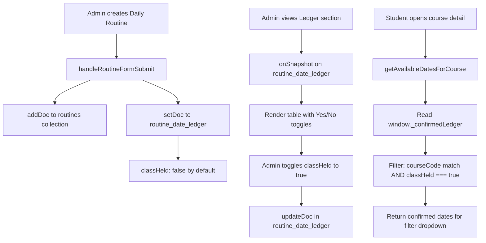

# Routine Date Ledger — Architecture & Implementation Plan

## Problem Statement

Currently `getAvailableDatesForCourse()` reads dates directly from the `routines` Firestore collection via `window._allDailyRoutines`. When admin updates/deletes daily routines, those dates vanish from the student filter — causing historical resource dates to disappear.

## Solution: `routine_date_ledger` Collection

A persistent Firestore collection that acts as an append-only ledger of every daily routine date. Admin toggles a **"Class Held? Yes/No"** switch. Only confirmed (Yes) dates appear in the student portal filter.

---

## Firestore Schema

### New Collection: `routine_date_ledger`

| Field | Type | Description |
|---|---|---|
| `courseCode` | string | Course code from routine |
| `subject` | string | Subject name from routine |
| `routineDate` | string | `YYYY-MM-DD` |
| `batchNumber` | string | Batch number |
| `teacherCode` | string | Teacher name/code |
| `classHeld` | boolean | **false** by default; admin toggles to true |
| `sourceRoutineId` | string | The `routines` doc ID that created this entry |
| `createdAt` | string | ISO timestamp |
| `confirmedAt` | string \| null | ISO timestamp when admin confirmed |
| `confirmedBy` | string \| null | Admin name/UID who confirmed |

**Document ID strategy:** Composite key `{courseCode}_{routineDate}` (e.g., `CSE101_2026-06-03`). This ensures one ledger entry per course per date — `setDoc` with `{ merge: true }` handles deduplication automatically when admin creates multiple routine slots for the same course on the same date.

---

## Data Flow



---

## Implementation Steps

### Step 1: Sync ledger on daily routine creation
**File:** `admin-dashboard.html` (inline script, ~line 443)
- Modify the `routineForm` submit handler to also write to `routine_date_ledger`
- Use `setDoc(doc(db, "routine_date_ledger", compositeKey), payload, { merge: true })`
- Composite key: `${courseCode.trim().toUpperCase()}_${routineDate}`
- This runs alongside the existing `handleRoutineFormSubmit` call

### Step 2: Build the "Routine Date Ledger" admin UI section
**File:** `admin-dashboard.html` (new HTML section after Manage Routines, before Student Uploaded Resources)
- New card: `<div class="portal-card bg-white p-4 rounded-xl shadow border-t-4 border-teal-600">`
- Header: "📋 Routine Date Ledger" with count badge
- Real-time `onSnapshot` listener on `routine_date_ledger` ordered by `routineDate` desc
- Table columns: Date | Course Code | Subject | Batch | Class Held? (toggle) | Confirmed By
- Each row has a toggle switch (checkbox styled as switch) for `classHeld`
- Bulk actions: "Confirm All Visible" button
- Filter by date range (optional enhancement)

### Step 3: Create ledger manager module
**File:** `assets/js/admin/routineLedgerManager.js` (NEW)
- `renderLedgerTable(snapshot, containerEl, countEl)` — renders the table
- `handleLedgerToggle(ledgerId, currentValue, db, doc, updateDoc, adminName)` — toggles classHeld
- `confirmAllVisible(visibleIds, db, doc, updateDoc, adminName)` — bulk confirm
- `formatLedgerRow(entry, index)` — renders a single table row with toggle

### Step 4: Wire ledger listener in admin dashboard
**File:** `admin-dashboard.html` (inline script)
- Import `renderLedgerTable`, `handleLedgerToggle`, `confirmAllVisible`
- Add `onSnapshot` listener on `routine_date_ledger` ordered by `routineDate` desc
- Wire toggle click events via event delegation
- Wire "Confirm All" button

### Step 5: Student portal — listen to confirmed ledger
**File:** `assets/js/portal/routines.js` — `initRoutineAndNoticeListeners()`
- Add a second `onSnapshot` listener on `routine_date_ledger` where `classHeld === true`
- Store results on `window._confirmedLedger = []` (array of confirmed ledger entries)
- Each entry has: `{ courseCode, routineDate, subject }`

### Step 6: Student portal — update getAvailableDatesForCourse
**File:** `assets/js/portal/courses.js`
- Replace the primary date source from `window._allDailyRoutines` to `window._confirmedLedger`
- Keep secondary fallback from existing resources with `routineDate`
- Filter: match `courseCode` (case-insensitive), extract `routineDate`

### Step 7: i18n keys
**File:** `assets/js/i18n.js` — add admin namespace keys:
- `ledgerTitle` en: "Routine Date Ledger", bn: "রুটিন ডেট লেজার"
- `ledgerDesc` en: "Confirm which dates classes were actually held", bn: "কোন তারিখে ক্লাস হয়েছে তা নিশ্চিত করুন"
- `ledgerColDate`, `ledgerColCourse`, `ledgerColSubject`, `ledgerColBatch`, `ledgerColHeld`, `ledgerColConfirmed`
- `ledgerClassHeld` en: "Class Held", bn: "ক্লাস হয়েছে"
- `ledgerClassNotHeld` en: "Not Held", bn: "ক্লাস হয়নি"
- `ledgerConfirmAll` en: "Confirm All Visible", bn: "সকল দৃশ্যমান কনফার্ম করুন"
- `ledgerNoEntries` en: "No routine dates synced yet", bn: "এখনো কোনো রুটিন ডেট সিঙ্ক হয়নি"
- `ledgerToggled` en: "Ledger updated", bn: "লেজার আপডেট হয়েছে"

### Step 8: Push to GitHub

---

## Key Design Decisions

1. **Composite doc ID prevents duplicates:** `CSE101_2026-06-03` — creating two routines for same course+date won't create duplicate ledger entries.
2. **Default `classHeld: false`:** Admin must explicitly confirm. This prevents unverified dates from appearing in student portal.
3. **Separate collection:** Ledger is independent of routines. Deleting a routine does NOT delete the ledger entry.
4. **`onSnapshot` for student portal:** Students see confirmed dates in real-time. No page refresh needed.
5. **Toggle, not delete:** Admin can flip Yes→No if needed, rather than deleting the entry.

---

## UI Mockup (Admin Dashboard)

```
┌─────────────────────────────────────────────────────────┐
│ 📋 Routine Date Ledger                     [12 entries] │
│ Confirm which dates classes were actually held          │
├──────────┬──────────┬──────────┬───────┬────────┬───────┤
│ Date     │ Code     │ Subject  │ Batch │ Held?  │ By    │
├──────────┼──────────┼──────────┼───────┼────────┼───────┤
│ 2026-06-03│ CSE101  │ Programming│ 50th │ [✅]   │ Admin │
│ 2026-06-03│ MAT201  │ Math III  │ 50th │ [❌]   │ -     │
│ 2026-06-02│ CSE101  │ Programming│ 50th │ [✅]   │ Admin │
│ 2026-06-01│ PHY101  │ Physics   │ 50th │ [❌]   │ -     │
└──────────┴──────────┴──────────┴───────┴────────┴───────┘
              [Confirm All Visible]
```

---

## Files Changed Summary

| File | Action | Description |
|---|---|---|
| `assets/js/admin/routineLedgerManager.js` | **NEW** | Ledger table renderer + toggle handler |
| `admin-dashboard.html` | MODIFY | Add ledger HTML section + sync on routine create + listener |
| `assets/js/portal/routines.js` | MODIFY | Add `onSnapshot` for confirmed ledger entries |
| `assets/js/portal/courses.js` | MODIFY | Switch `getAvailableDatesForCourse` primary source |
| `assets/js/i18n.js` | MODIFY | Add admin ledger i18n keys |